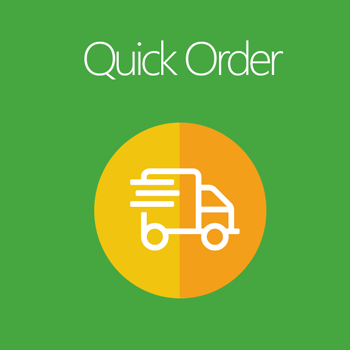
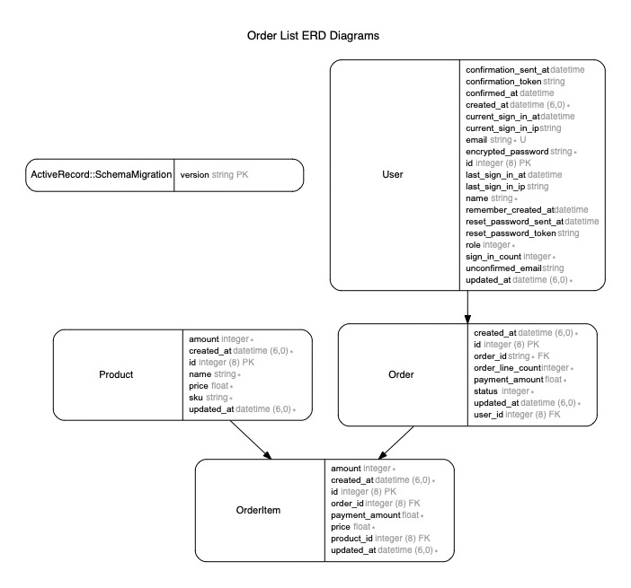
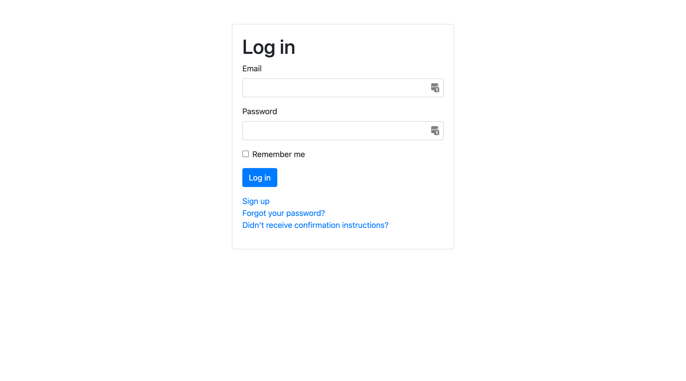
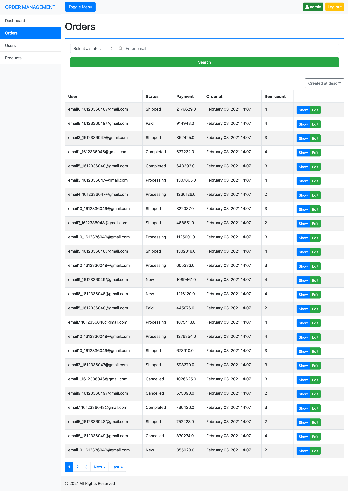
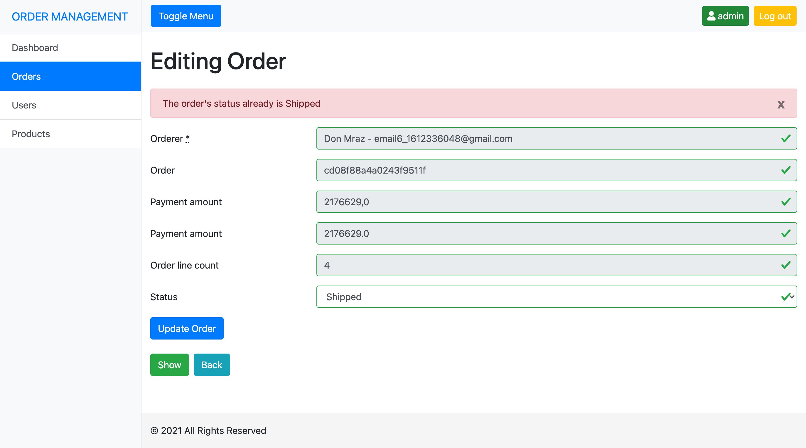
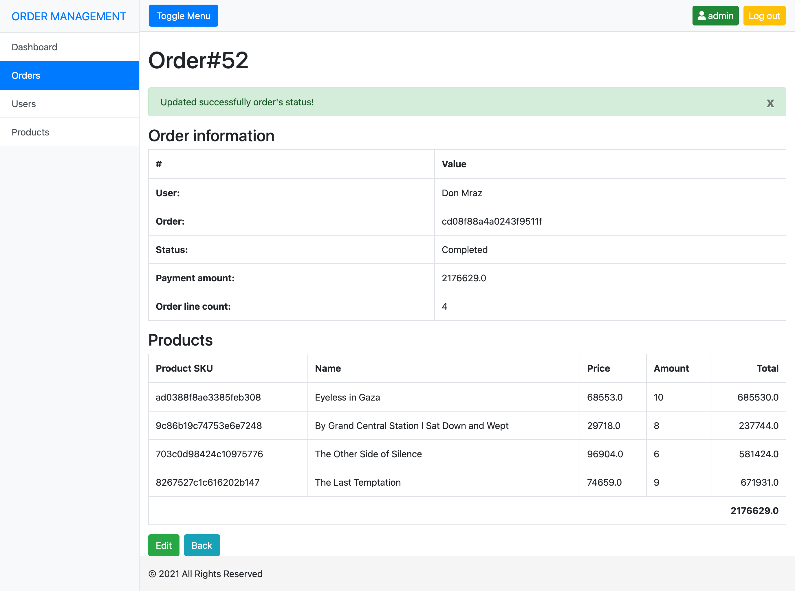
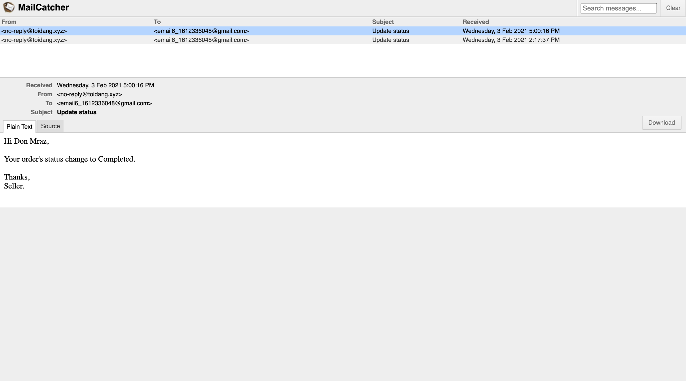

# README

<!-- PROJECT LOGO -->
<br />
<p align="center">
  <a href="https://github.com/toidang92">
    
  </a>

  <h3 align="center">Order List</h3>
</p>


<!-- TABLE OF CONTENTS -->
<details open="open">
  <summary><h2 style="display: inline-block">Table of Contents</h2></summary>
  <ol>
    <li><a href="#i-about-the-project">About the project</a></li>
    <li><a href="#ii-erd">ERD</a></li>
    <li><a href="#iii-installation">Installation</a></li>
    <li><a href="#vi-screenshots">Screenshots</a></li>
    <li><a href="#v-contact">Contact</a></li>
  </ol>
</details>


<!-- ABOUT THE PROJECT -->
## I. About The Project

Order System:

### Built With

* [Rails 6.1.1](https://github.com/rails/rails)
* [Rspec](https://rspec.info/)
* [Postgres 12.5](https://www.postgresql.org/)
* [Redis 6.0.10](https://redis.io/)
* [Nginx 1.19.6](https://www.nginx.com/)
* [Docker 20.10.2](https://www.docker.com/)
* [Docker compose 1.27.4](https://docs.docker.com/compose/)
* [Yarn](https://yarnpkg.com/)
* [Webpack](https://webpack.js.org/)
* [jQuery](https://jquery.com/)
* [Bootstrap](https://getbootstrap.com/)


<!-- ERD -->
## II. ERD

### 1. Database diagram



<!-- INSTALLATION -->
## III. Installation

### 1. Setup local domain name

```
/etc/hosts
127.0.0.1    toidang.dev.local
```

### 2. Set up local configurations

```
cp config/database.yml.example config/database.yml
cp config/application.yml.example config/application.yml
```

### 3. Set up docker compose

URL: [Docker Compose](https://docs.docker.com/compose/install/)

### 4. Let's run the application on Docker

```
docker-compose up app
```
Login account:

```
Email: admin@toidang.xyz
Password: admin123123
```

URLS:

1. Main: http://toidang.dev.local:3000/
2. Sidekiq: http://toidang.dev.local:3000/sidekiq

### 5. Start Nginx on Docker

```
docker-compose up nginx
```

URLS:

1. Main: http://toidang.dev.local/
2. Sidekiq: http://toidang.dev.local/sidekiq

### 6. Execute  unit test with rspec

```
docker-compose exec app bundle exec rake db:create RAILS_ENV=test
docker-compose exec app bundle exec rspec
```

### 7. Check mail on mailcatcher

```
http://toidang.dev.local:1080/
```

### 8. Notes

- Sometimes, the javascript file loads incorrectly, because the yarn and application compile javscript files at the same time, lead to wrong compile files. Please change somethings at `app/javascript/packs/application.js` (EX. add console.log), then save and reload the pages. (Note: it still works well on production).

- In the development environment, I use `Mailcatcher` as an SMTP server that catches messages sent to it to display in a web interface. Besides, we can use `postfix` for forwarding emails.

- The `config/master.key` must be not pushed into Github because of security reasons. But I still pushed because it does not have any critical info and it will easy to check.

<!-- SCREENSHOTS -->
## VI. Screenshots

### 1. Login



### 2. Order List



### 3. Update Fail



### 4. Update Success



### 5. Mail



<!-- CONTACT -->
## V. Contact

Tới Đặng - [@toidang92](https://github.com/toidang92) - toidang92@gmail.com

Project Link: [Order System](https://github.com/toidang92/order-list)
