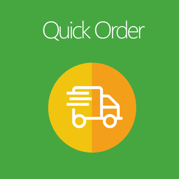
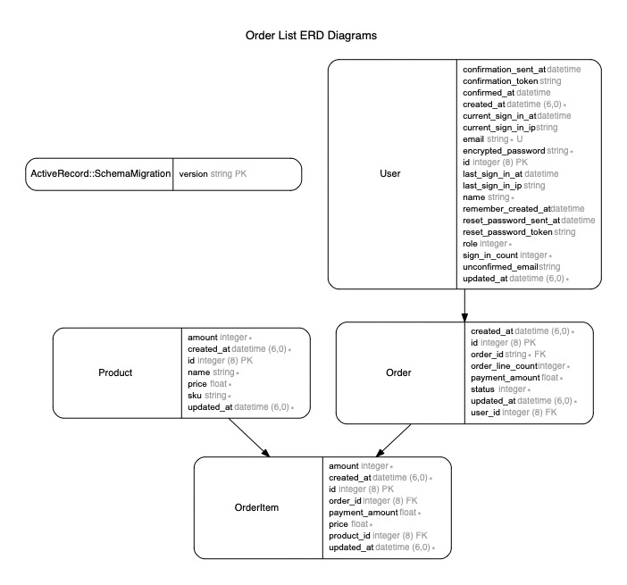

# README

<!-- PROJECT LOGO -->
<br />
<p align="center">
  <a href="https://github.com/toidang92">
    
  </a>

  <h3 align="center">Order List</h3>
</p>


<!-- TABLE OF CONTENTS -->
<details open="open">
  <summary><h2 style="display: inline-block">Table of Contents</h2></summary>
  <ol>
    <li><a href="#erb">ERD</a></li>
    <li><a href="#installation">Installation</a></li>
    <li><a href="#contact">Contact</a></li>
  </ol>
</details>


<!-- ABOUT THE PROJECT -->
## About The Project

[![Product Name Screen Shot][product-screenshot]](https://example.com)

Here's a blank template to get started:
**To avoid retyping too much info. Do a search and replace with your text editor for the following:**
`github_username`, `repo_name`, `twitter_handle`, `email`, `project_title`, `project_description`


### Built With

* [Rails 6.1.1](https://github.com/rails/rails)
* [Rspec](https://rspec.info/)
* [Postgres 12.5](https://www.postgresql.org/)
* [Redis 6.0.10](https://redis.io/)
* [Nginx 1.19.6](https://www.nginx.com/)
* [Docker 20.10.2](https://www.docker.com/)
* [Docker compose 1.27.4](https://docs.docker.com/compose/)
* [Yarn](https://yarnpkg.com/)
* [Webpack](https://webpack.js.org/)
* [jQuery](https://jquery.com/)
* [Bootstrap](https://getbootstrap.com/)


<!-- ERD -->
## ERD



<!-- INSTALLATION -->
## Installation

```
/etc/hosts
127.0.0.1    toidang.dev.local
```

```
cp config/database.yml.example config/database.yml
cp config/application.yml.example config/application.yml
docker-compose up app
```

URL: http://toidang.dev.local:3000/
URL: http://toidang.dev.local:3000/sidekiq

```
docker-compose up nginx
```

URL: http://toidang.dev.local/
URL: http://toidang.dev.local/sidekiq

```
docker-compose exec app bundle exec rspec
```

```
http://toidang.dev.local:1080/
```


<!-- CONTACT -->
## Contact

Tới Đặng - [@toidang92](https://github.com/toidang92) - toidang92@gmail.com

Project Link: [order-list](https://github.com/toidang92/order-list)
